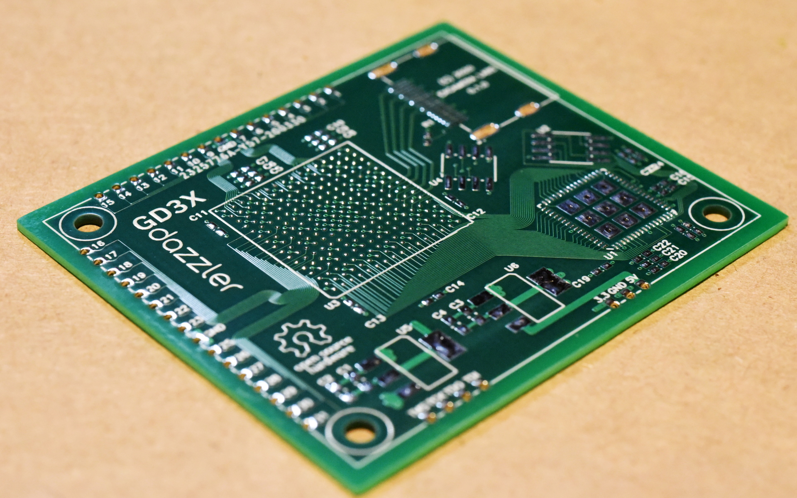

# cuflow

CuFlow ("Copper Flow") is an experimental procedural PCB layout program.

It's a Python module that, given a description of a board, generates all the outputs for a PCB:

 * Gerbers
 * drill file
 * BOM
 * PnP definitions
 * POVRay renderings
 * SVGs for laser cut mockups

The Gameduino 3X Dazzler was designed with CuFlow.

To generate the Dazzler board:

    python dazzler.py

To generate the Arduino-Dazzler interface board:

    python arduino_dazzler.py

Some notes on the theory and the practice:

 * [Motivation](http://tinyletter.com/jamesbowman/letters/How-would-Bob-Ross-lay-out-a-PCB)
 * [The geometry of river routing](http://tinyletter.com/jamesbowman/letters/the-geometry-of-river-routing)
 * [The Dazzler PCB](http://tinyletter.com/jamesbowman/letters/gameduino-dazzler-pcb-first-pictures)
 * [laser cut mockups](http://tinyletter.com/jamesbowman/letters/the-map-is-not-the-territory)

