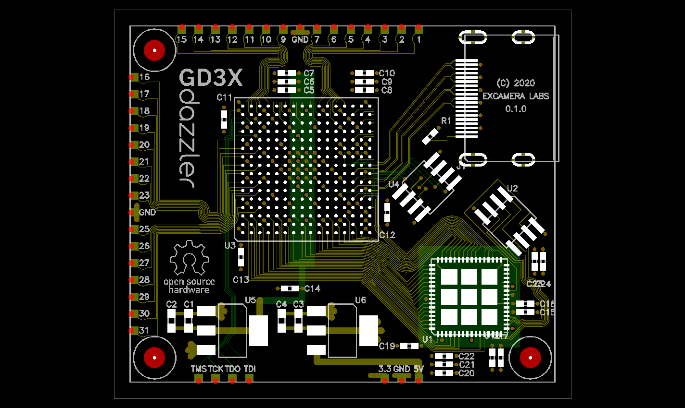

# cuflow

CuFlow ("Copper Flow") is an experimental procedural PCB layout program.

It's a Python module that, given a description of a board, generates all the outputs for a PCB: Gerbers, drill files, BOM, PnP files and renderings.

The Gameduino 3X Dazzler was designed with CuFlow.

To generate the Dazzler board:

    python dazzler.py

To generate the Arduino-Dazzler interface board:

    python arduino_dazzler.py
