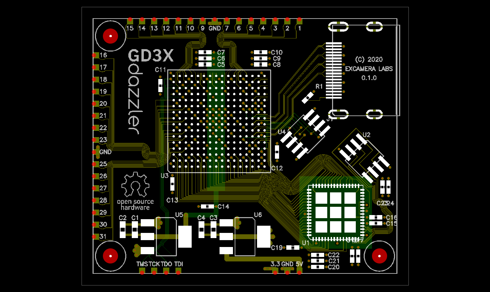
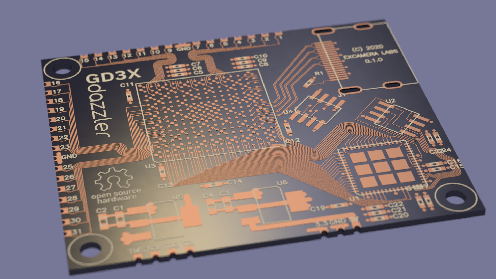
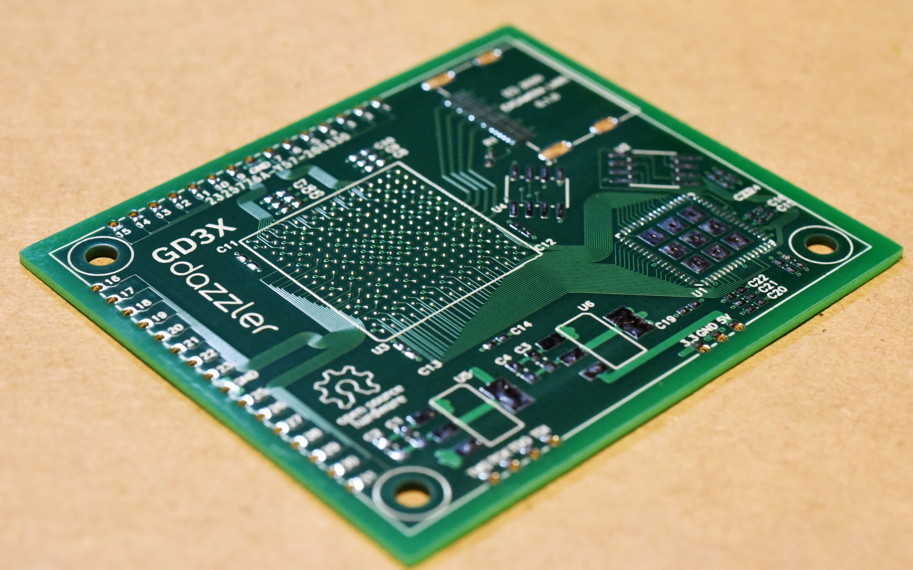

# cuflow

CuFlow ("Copper Flow") is an experimental procedural PCB layout program.

It's a Python module that, given a description of a board, generates all the outputs for a PCB:

 * Gerbers
 * drill file
 * BOM
 * PnP definitions
 * POVRay renderings
 * SVGs for laser cut mockups

The Gameduino 3X Dazzler was designed with CuFlow.

To generate the Dazzler board:

    python dazzler.py

To generate the Arduino-Dazzler interface board:

    python arduino_dazzler.py

To fetch the STEP and WRL models for every LCSC code in a generated BOM:

    python fetch_bom_models.py spiq_a-bom.csv

Models are deduplicated by LCSC part number and written to `assets/step/`, for
example `assets/step/C25100.step` and `assets/step/C25100.wrl`. Existing model
pairs are left untouched unless `--overwrite` is supplied. The command keeps
successful downloads and exits nonzero if any BOM entry has no available model.
It also records EasyEDA's footprint transforms in `assets/step/models.json`.

To refresh the browser-ready mesh cache after fetching models:

    npm --prefix webviewer run convert:models

STL assets can be converted to the same browser-ready mesh format. STL has no
standard units or material data, so the converter assumes millimetres and
accepts an optional RGB color:

    node webviewer/convert-stl.js input.stl output.mesh.json [RRGGBB]

For the SPIQ LCD bezel:

    npm --prefix webviewer run convert:bezel

Some notes on the theory and the practice:

 * [Motivation](http://tinyletter.com/jamesbowman/letters/How-would-Bob-Ross-lay-out-a-PCB)
 * [The geometry of river routing](http://tinyletter.com/jamesbowman/letters/the-geometry-of-river-routing)
 * [The Dazzler PCB](http://tinyletter.com/jamesbowman/letters/gameduino-dazzler-pcb-first-pictures)
 * [laser cut mockups](http://tinyletter.com/jamesbowman/letters/the-map-is-not-the-territory)

